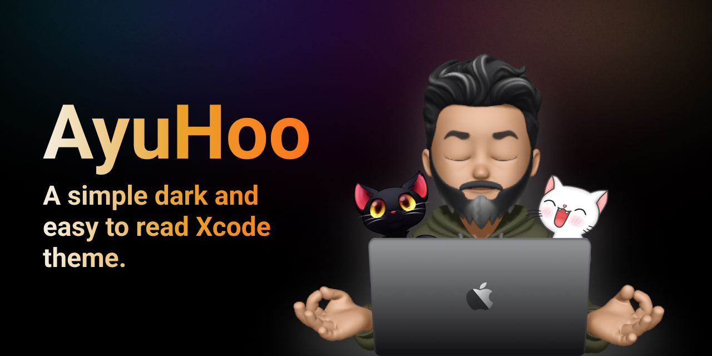
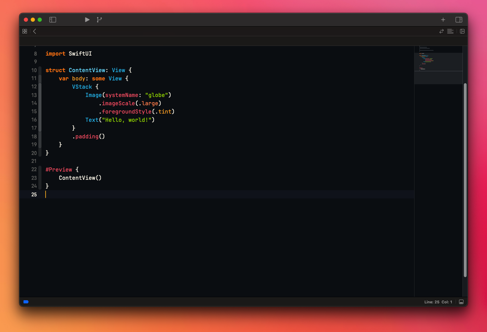
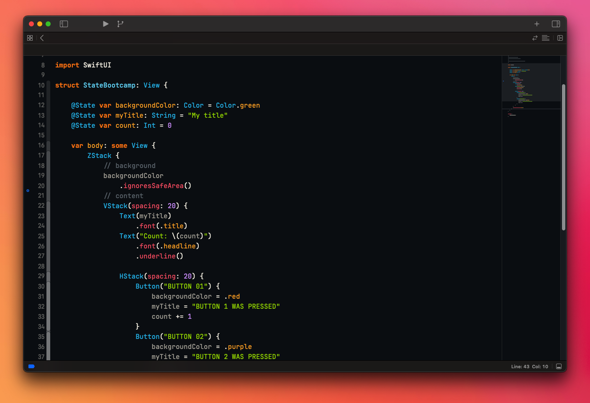
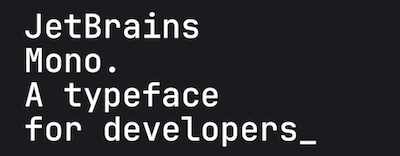

This Xcode theme is based on **_ayu Theme_** color palette. It's feature is to make the code very easy to read with an nice contrast even in bright daylight.

## Screenshots




## Installation

1. You can install the theme by downloading the **"AyuHoo.xccolortheme"** theme file and copy to folder:

```swift
   ~/Library/Developer/Xcode/UserData/FontAndColorThemes
```

2. Restart Xcode.
3. Go to preferences and select **AyuHoo** in the theme panel.

> **Warning**: If the folder doesn't exist, create it manually!

## Font recomendation

The theme uses the excellent open-source font [JetBrains Mono](https://www.jetbrains.com/pt-br/lp/mono/) that uses ligatures to reduce noise by blending symbols and removing details so the eyes process less.

Recommended settings for Xcode:

1. Font: JetBrains Mono Regular
2. Font size: 15.
3. Keywords font: JetBrains Mono Extra Bold, size 15.

These are my personal configurations. Do your own tests and find out the font size and configurations that best suits your needs.

You can download JetBrains Mono [HERE](https://www.jetbrains.com/pt-br/lp/mono/ "download")



## Author

<a href="https://andreporto.vercel.app">
 </a>
 <br/>

Made with ❤️ by André Porto.

[](https://twitter.com/tgmarinho) [](https://www.linkedin.com/in/andremporto/)
[](mailto:andreporto@me.com)
